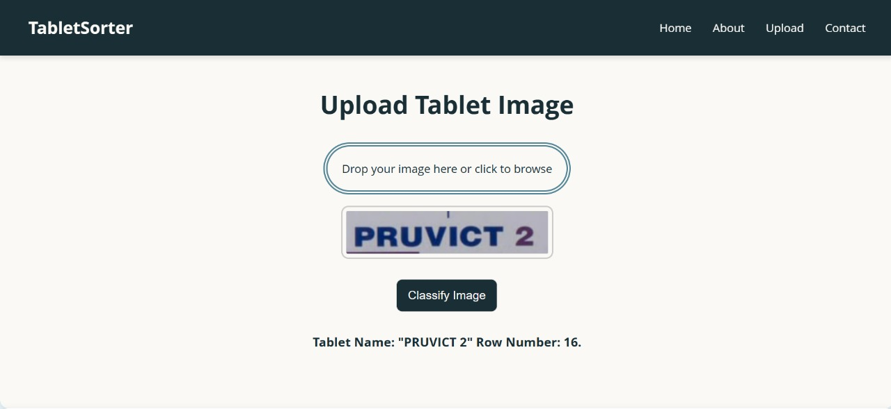

# 💊 PharmAI – Intelligent Tablet Name Recognition & Row Placement System

PharmAI is an OCR-powered system designed to automate the identification and placement of pharmaceutical tablets using image processing, machine learning, and voice feedback. This project aims to enhance pharmacy workflows by reducing manual sorting errors and improving efficiency through AI-driven automation.

---

## 📌 Features

- 📷 **Tablet Image Upload** – Supports image input via camera or file upload.
- 🧠 **OCR-Based Name Recognition** – Uses EasyOCR for high-accuracy text extraction from packaging.
- 🗂️ **Automated Row Placement** – Assigns tablets to rows based on the first letter of the name.
- 🔊 **Voice Feedback** – Announces row placement using Text-to-Speech (TTS) via JavaScript Web Speech API.
- 🌐 **User-Friendly Interface** – Built with Flask (backend) and HTML/CSS/JS (frontend).
- 📈 **High Accuracy** – Achieves 97% OCR accuracy and 99.68% row placement accuracy.

---

## 🧪 Tech Stack

| Component | Technology |
|----------|-------------|
| Language | Python 3.10 |
| OCR | EasyOCR |
| Voice | JavaScript Web Speech API |
| UI | HTML, CSS, JavaScript |
| Backend | Flask |
| Image Processing | OpenCV, NumPy |
| Text-to-Speech | pyttsx3 (Python) & Web Speech API (JS) |

---

## 🚀 Getting Started

### Prerequisites

- Python 3.8+
- pip (Python package manager)
- Virtualenv (optional but recommended)

### Installation

```bash
git clone https://github.com/Tejas-Noojile/PharmAI-Intelligent_Tablet_Name_Recognition.git
cd PharmAI-Intelligent_Tablet_Name_Recognition
pip install -r requirements.txt
```

### Run Locally

```bash
python app.py
```

Open your browser and go to: `http://localhost:5000`

---

## 🖼️ Screenshots

> Include screenshots of the web UI showing image upload, OCR result, and voice feedback.
> _You can place them in a `/screenshots` folder and reference like so:_




---

## 📊 Model Performance

| Model       | Accuracy | Inference Time | Size     |
|-------------|----------|----------------|----------|
| Custom CNN  | 68%      | ~25 ms         | ~5 MB    |
| MobileNetV2 | 70%      | ~30 ms         | ~14 MB   |
| VGG16       | 81%      | ~120 ms        | ~528 MB  |
| **EasyOCR** | **97%**  | ~45 ms         | ~30 MB   |

---

## 📚 Methodology Summary

1. **Image Acquisition** – Captures or uploads tablet images.
2. **Preprocessing** – Resizes, denoises, and enhances text areas.
3. **OCR Extraction** – Extracts tablet name via EasyOCR.
4. **Text Cleaning** – Fixes spacing/case errors for accuracy.
5. **Row Placement** – Assigns row based on tablet’s first letter.
6. **Voice Output** – Announces result via TTS module.
7. **Frontend UI** – Displays image, text, and row info visually.

---

## 🔮 Future Scope

- 📦 Barcode scanner integration
- 🌐 Multilingual OCR support
- 📈 Real-time inventory tracking
- 🤖 AI-powered misplacement alerts
- 💾 Integration with pharmacy management systems

---

## 👨‍💻 Authors

- Tejas Noojile [@Tejas-Noojile](https://github.com/Tejas-Noojile)
- Shreya T N
- Shashank D Y
- Vikram Ram S  
- Guided by: Sunnitha P  
  Department of Computer Science and Engineering  
  Malnad College of Engineering, Hassan – 573201

---

## 📄 License

This project is open-source and available under the [MIT License](LICENSE).

---

## 🙌 Acknowledgements

- EasyOCR
- OpenCV
- Flask
- Web Speech API - MDN
